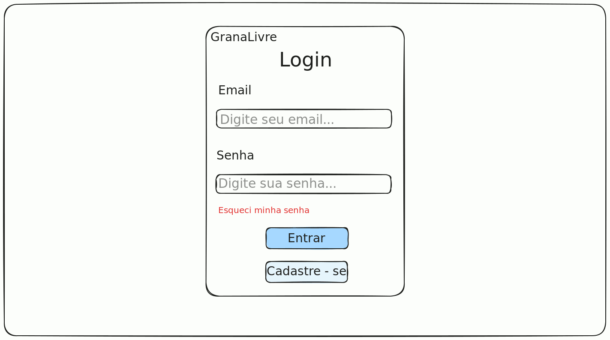

# Grana Livre 💸


**Uma plataforma open source de gerenciamento de finanças pessoais, desenvolvida por brasileiros e para brasileiros.**



---

## 📖 Tabela de Conteúdos

- [Sobre o Projeto](#-sobre-o-projeto)
- [✨ Funcionalidades](#-funcionalidades)
- [🛠️ Tecnologias Utilizadas](#️-tecnologias-utilizadas)
- [🚀 Começando](#-começando)
  - [Pré-requisitos](#pré-requisitos)
  - [Instalação](#instalação)
- [📂 Estrutura de Arquivos](#-estrutura-de-arquivos)
- [🤝 Como Contribuir](#-como-contribuir)

---

## 💻 Sobre o Projeto

O **Grana Livre** nasceu da necessidade de uma ferramenta de controle financeiro que fosse ao mesmo tempo poderosa, acessível e alinhada à realidade brasileira. Muitas soluções no mercado são pagas, limitadas ou não transparentes com o uso dos dados do usuário. Além disso, a documentação em inglês e a complexidade de projetos já estabelecidos dificultam a entrada de novos desenvolvedores, especialmente estudantes e a comunidade brasileira.

Nosso objetivo é criar uma plataforma **gratuita, de código aberto e totalmente documentada em português**, que não apenas ajude os usuários a organizar suas finanças, mas que também sirva como um **ambiente de aprendizado e colaboração** para desenvolvedores do Brasil.

### Por que o Grana Livre?

- **Gratuito e Acessível:** Controle total sobre suas finanças sem custos ou limitações.
- **Transparência e Segurança:** Seu código é aberto. Você sabe exatamente como seus dados são tratados.
- **Foco na Comunidade Brasileira:** Desenvolvido pensando nas nossas necessidades, com documentação e suporte em português.
- **Ambiente Colaborativo:** Um projeto ideal para quem quer aprender, contribuir e crescer junto com uma comunidade engajada.

---

## ✨ Funcionalidades

O Grana Livre permite que você organize toda a sua vida financeira em um só lugar:

- ✅ **Dashboard Intuitivo:** Tenha um resumo claro do seu saldo, patrimônio e movimentações recentes.
- 📊 **Gestão de Receitas e Despesas:** Registre e categorize todas as suas entradas e saídas.
- 🔄 **Contas Recorrentes:** Automatize o controle de despesas fixas como aluguel, assinaturas e contas de consumo.
- 📈 **Controle de Investimentos:** Cadastre e acompanhe a evolução dos seus investimentos.
- 🏠 **Gerenciamento de Patrimônio:** Registre bens como imóveis e veículos para ter uma visão completa do seu patrimônio.
- 🎯 **Metas Financeiras (em breve):** Planeje seus objetivos e acompanhe seu progresso.

---

## 🛠️ Tecnologias Utilizadas

O projeto é construído com tecnologias modernas e robustas, separando as responsabilidades entre o frontend e o backend.

| Camada         | Tecnologias                                                                                                                                                                                                                                   |
| :------------- | :-------------------------------------------------------------------------------------------------------------------------------------------------------------------------------------------------------------------------------------------- |
| **Frontend**   |    |
| **Backend**    |                               |
| **Banco de Dados** |                                                                                                                              |
| **Ambiente**   |                                                                                                                                 |
| **Controle de Versão** |                     |

---

## 🚀 Começando

Para executar o projeto localmente, recomendamos o uso de Docker, que simplifica a configuração do ambiente.

### Pré-requisitos

Antes de começar, garanta que você tenha as seguintes ferramentas instaladas:

- Git
- Docker
- Docker Compose

### Instalação

1. **Clone o repositório:**

   ```sh
   git clone https://github.com/fromcaio/granalivre.git
   cd granalivre/codigo-fonte/
   ```

2. **Suba os contêineres do Docker:**

   O projeto é containerizado para facilitar a execução.

   ```sh
   docker compose up --build
   ```

   Este comando irá construir as imagens do frontend e do backend e iniciar os serviços.

   > **Nota:** O primeiro build pode demorar alguns minutos, pois instala todas as dependências e configura o ambiente de desenvolvimento com live reload (hot reload) para backend e frontend. Nas próximas execuções, o processo será muito mais rápido, pois as camadas já estarão em cache.

3. **Acesse a aplicação:**

   - Frontend: http://localhost:3000
   - Backend API: http://localhost:8000

Para guias mais detalhados sobre como executar cada parte separadamente, consulte nossos tutoriais:

- [Guia de Execução do Backend](doc/tutoriais/backend.md)
- [Guia de Execução do Frontend](doc/tutoriais/frontend.md)

---

## 📂 Estrutura de Arquivos

O projeto está organizado da seguinte forma para facilitar a navegação e o desenvolvimento:

```bash
granalivre/
├── .github/              # Configurações de Actions e templates para o GitHub
├── codigo-fonte/         # Código principal da aplicação
│   ├── backend/          # Aplicação Django (Python)
│   └── frontend/         # Aplicação Next.js
├── doc/                  # Documentação completa do projeto
│   ├── diagramas/        # Diagramas de arquitetura, casos de uso, etc.
│   ├── telas/            # Protótipos de baixa e alta fidelidade
│   └── tutoriais/        # Guias de configuração e execução
└── README.md             # Este arquivo que você está lendo :)
```

---

## 🤝 Como Contribuir

Nós encorajamos fortemente a contribuição da comunidade! Se você quer ajudar a construir o Grana Livre, aqui estão algumas formas de começar:

1. **Reporte Bugs e Sugira Ideias:** Abra uma Issue detalhando o problema ou a sua sugestão de melhoria.
2. **Melhore a Documentação:** Encontrou algo que pode ser melhor explicado? Nos ajude a melhorar a documentação!
3. **Desenvolva Funcionalidades:** Se você quer colocar a mão no código, siga os passos abaixo.

### Fluxo de Contribuição

1. Faça um Fork do projeto.
2. Crie uma branch para a sua funcionalidade:
   ```sh
   git checkout -b feature/minha-feature
   ```
3. Faça o commit das suas alterações:
   ```sh
   git commit -m 'feat: Adiciona minha feature'
   ```
4. Faça o push para a sua branch:
   ```sh
   git push origin feature/minha-feature
   ```
5. Abra um Pull Request para que possamos avaliar
